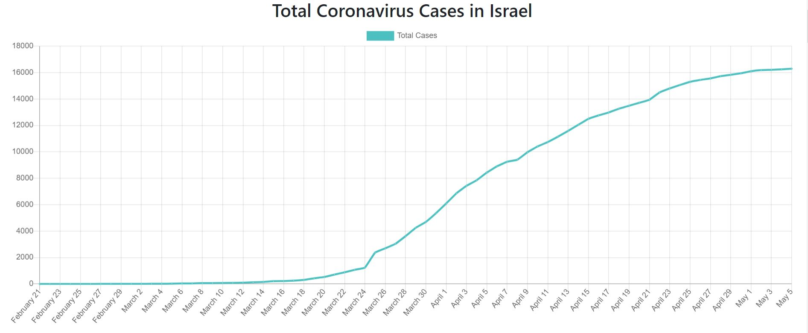
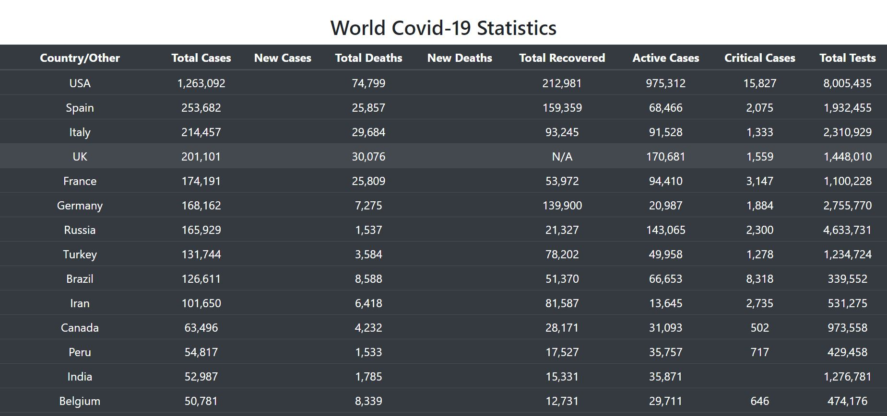

APP: AUTOMATION WEB SCRAPING USING SELENIUM

STACKS USE: DJANGO, SELENIUM, PYMONGO, MONGODB ATLAS, REACT, fetchAPI

RESOURCES:https://www.worldometers.info/coronavirus , https://api.covid19api.com

INSTALL DEPENDENCIES THEN
RUN SERVER - python manage.py runserver
RUN CLIENT - npm start